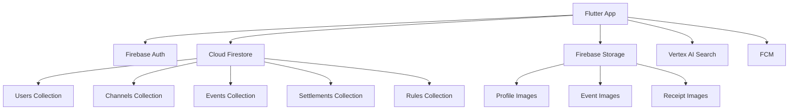
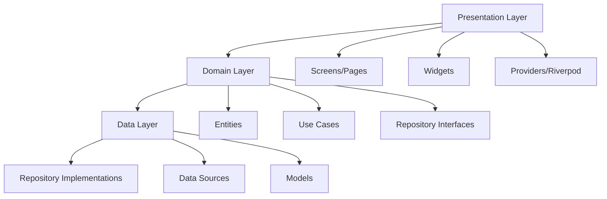

# 설계 문서

## 개요

커뮤니티 채널 관리 시스템은 기존 커뮤니티의 효율적인 관리를 위한 Flutter 기반 모바일 애플리케이션입니다. 이 시스템은 벙(이벤트) 관리, 멤버 관리, 정산 기능, AI 기반 회칙 문의 챗봇을 제공합니다.

## 기술 스택

- **프론트엔드**: Flutter (Dart)
- **상태 관리**: Riverpod
- **인증**: Firebase Authentication
- **데이터베이스**: Cloud Firestore
- **파일 저장소**: Firebase Storage
- **AI 검색**: Google Vertex AI Search
- **푸시 알림**: Firebase Cloud Messaging (FCM)

## 아키텍처

### 전체 시스템 아키텍처



### 앱 아키텍처 (Clean Architecture + MVVM)



## 컴포넌트 및 인터페이스

### 1. 인증 시스템

#### AuthService
```dart
abstract class AuthService {
  Future<User?> signInWithGoogle();
  Future<User?> signInWithApple();
  Future<void> signOut();
  Stream<User?> get authStateChanges;
}
```

#### User Entity
```dart
enum UserRole {
  admin,        // 관리자 (모임장)
  member        // 일반 멤버
}

enum UserStatus {
  active,       // 활성
  restricted,   // 활동 제한
  banned        // 강제 탈퇴
}

class User {
  final String id;
  final String email;
  final String displayName;
  final String? photoURL;
  final UserRole role;
  final UserStatus status;
  final DateTime createdAt;
  final DateTime lastLoginAt;
}
```

### 2. 채널 관리 시스템

#### Channel Entity
```dart
enum ChannelStatus {
  active,       // 활성
  inactive,     // 비활성
  archived      // 보관됨
}

class ChannelMember {
  final String userId;
  final UserRole role;
  final UserStatus status;
  final DateTime joinedAt;
}

class Channel {
  final String id;
  final String name;
  final String description;
  final String adminId;
  final String inviteCode;
  final List<ChannelMember> members;
  final ChannelStatus status;
  final DateTime createdAt;
  final DateTime updatedAt;
}
```

#### ChannelRepository
```dart
abstract class ChannelRepository {
  Future<Channel> createChannel(String name, String description);
  Future<Channel?> joinChannelByInviteCode(String inviteCode);
  Future<List<Channel>> getUserChannels(String userId);
  Future<void> updateChannel(Channel channel);
  Future<String> generateNewInviteCode(String channelId);
}
```

### 3. 벙(이벤트) 관리 시스템

#### Event Entity
```dart
enum EventStatus { 
  scheduled,    // 예정됨
  closed,       // 마감됨
  ongoing,      // 진행중
  completed,    // 완료됨
  cancelled     // 취소됨
}

enum ParticipationStatus {
  participating,  // 참여중
  waiting,       // 대기중
  cancelled      // 참여취소
}

class Event {
  final String id;
  final String channelId;
  final String organizerId;
  final String title;
  final String description;
  final DateTime scheduledAt;
  final String location;
  final int maxParticipants;
  final List<String> participantIds;
  final List<String> waitingIds;
  final EventStatus status;
  final bool requiresSettlement;
  final DateTime createdAt;
  final DateTime updatedAt;
}
```

#### EventRepository
```dart
abstract class EventRepository {
  Future<Event> createEvent(Event event);
  Future<List<Event>> getChannelEvents(String channelId);
  Future<List<Event>> getUserEvents(String userId);
  Future<void> joinEvent(String eventId, String userId);
  Future<void> leaveEvent(String eventId, String userId);
  Future<void> updateEventStatus(String eventId, EventStatus status);
  Stream<List<Event>> watchChannelEvents(String channelId);
}
```

### 4. 정산 시스템

#### Settlement Entity
```dart
enum SettlementStatus { 
  pending,      // 정산 대기
  completed     // 정산 완료
}

enum PaymentStatus {
  pending,      // 입금 대기
  completed,    // 입금 완료
  overdue       // 연체
}

class Settlement {
  final String id;
  final String eventId;
  final String organizerId;
  final String bankName;
  final String accountNumber;
  final String accountHolder;
  final double totalAmount;
  final Map<String, double> participantAmounts;
  final Map<String, PaymentStatus> paymentStatus;
  final List<String> receiptUrls;
  final SettlementStatus status;
  final DateTime createdAt;
}
```

#### SettlementRepository
```dart
abstract class SettlementRepository {
  Future<Settlement> createSettlement(Settlement settlement);
  Future<void> markPaymentComplete(String settlementId, String userId);
  Future<void> completeSettlement(String settlementId);
  Future<Settlement?> getEventSettlement(String eventId);
}
```

### 5. 회칙 및 AI 챗봇 시스템

#### Rule Entity
```dart
class Rule {
  final String id;
  final String channelId;
  final String title;
  final String content;
  final DateTime createdAt;
  final DateTime updatedAt;
}
```

#### Chatbot 관련 Enums 및 Service
```dart
enum MessageStatus {
  sent,         // 전송됨
  delivered,    // 전달됨
  failed        // 실패
}

enum MessageType {
  question,     // 질문
  answer        // 답변
}

class ChatMessage {
  final String id;
  final String userId;
  final String channelId;
  final String content;
  final MessageType type;
  final MessageStatus status;
  final DateTime timestamp;
}

abstract class ChatbotService {
  Future<String> askQuestion(String channelId, String question);
  Future<List<ChatMessage>> getChatHistory(String userId, String channelId);
  Future<void> saveChatMessage(ChatMessage message);
}
```

### 6. 알림 시스템

#### Notification 관련 Enums 및 Service
```dart
enum NotificationType {
  eventCreated,       // 새 벙 생성
  eventUpdated,       // 벙 정보 변경
  eventCancelled,     // 벙 취소
  eventJoined,        // 벙 참여
  eventLeft,          // 벙 참여 취소
  settlementCreated,  // 정산 생성
  paymentReceived,    // 입금 완료
  announcement,       // 공지사항
  memberJoined,       // 새 멤버 가입
  memberLeft          // 멤버 탈퇴
}

enum NotificationStatus {
  pending,      // 대기중
  sent,         // 전송됨
  delivered,    // 전달됨
  read,         // 읽음
  failed        // 실패
}

class AppNotification {
  final String id;
  final String channelId;
  final List<String> recipientIds;
  final NotificationType type;
  final String title;
  final String message;
  final Map<String, dynamic> data;
  final NotificationStatus status;
  final DateTime createdAt;
}

abstract class NotificationService {
  Future<void> sendEventCreatedNotification(String channelId, Event event);
  Future<void> sendAnnouncementNotification(String channelId, String message);
  Future<void> sendSettlementNotification(String eventId, Settlement settlement);
  Future<void> sendEventUpdateNotification(String eventId, String message);
  Future<List<AppNotification>> getUserNotifications(String userId);
  Future<void> markNotificationAsRead(String notificationId);
}
```

## 데이터 모델

### Firestore 컬렉션 구조

#### Users Collection
```
users/{userId}
├── email: string
├── displayName: string
├── photoURL: string
├── createdAt: timestamp
├── lastLoginAt: timestamp
└── fcmToken: string
```

#### Channels Collection
```
channels/{channelId}
├── name: string
├── description: string
├── adminId: string
├── inviteCode: string
├── memberIds: array<string>
├── createdAt: timestamp
└── updatedAt: timestamp

channels/{channelId}/rules/{ruleId}
├── title: string
├── content: string
├── createdAt: timestamp
└── updatedAt: timestamp
```

#### Events Collection
```
events/{eventId}
├── channelId: string
├── organizerId: string
├── title: string
├── description: string
├── scheduledAt: timestamp
├── location: string
├── maxParticipants: number
├── participantIds: array<string>
├── waitingIds: array<string>
├── status: string
├── requiresSettlement: boolean
├── createdAt: timestamp
└── updatedAt: timestamp
```

#### Settlements Collection
```
settlements/{settlementId}
├── eventId: string
├── organizerId: string
├── bankName: string
├── accountNumber: string
├── accountHolder: string
├── totalAmount: number
├── participantAmounts: map<string, number>
├── paymentStatus: map<string, boolean>
├── receiptUrls: array<string>
├── status: string
└── createdAt: timestamp
```

#### Chat History Collection
```
chatHistory/{userId}/channels/{channelId}/messages/{messageId}
├── question: string
├── answer: string
├── timestamp: timestamp
├── userId: string
└── status: string  // MessageStatus enum 값
```

#### Notifications Collection
```
notifications/{notificationId}
├── channelId: string
├── recipientIds: array<string>
├── type: string        // NotificationType enum 값
├── title: string
├── message: string
├── data: map
├── status: string      // NotificationStatus enum 값
└── createdAt: timestamp
```

## 에러 처리

### 에러 타입 정의
```dart
enum ErrorType {
  auth,           // 인증 에러
  network,        // 네트워크 에러
  validation,     // 유효성 검사 에러
  permission,     // 권한 에러
  notFound,       // 데이터 없음
  serverError     // 서버 에러
}

abstract class AppException implements Exception {
  final String message;
  final ErrorType type;
  final String code;
  
  const AppException(this.message, this.type, this.code);
}

class AuthException extends AppException {
  const AuthException(String message) : super(message, ErrorType.auth, 'AUTH_ERROR');
}

class NetworkException extends AppException {
  const NetworkException(String message) : super(message, ErrorType.network, 'NETWORK_ERROR');
}

class ValidationException extends AppException {
  const ValidationException(String message) : super(message, ErrorType.validation, 'VALIDATION_ERROR');
}

class PermissionException extends AppException {
  const PermissionException(String message) : super(message, ErrorType.permission, 'PERMISSION_ERROR');
}
```

### 에러 처리 전략
1. **네트워크 에러**: 재시도 로직 및 오프라인 모드 지원
2. **인증 에러**: 자동 로그아웃 및 재로그인 유도
3. **유효성 검사 에러**: 사용자 친화적 메시지 표시
4. **서버 에러**: 에러 로깅 및 대체 UI 표시

## 테스트 전략

### 테스트 피라미드
1. **Unit Tests (70%)**
   - Repository 구현체
   - Use Case 로직
   - 유틸리티 함수
   - 데이터 모델 변환

2. **Integration Tests (20%)**
   - Firebase 연동
   - API 호출
   - 데이터 흐름

3. **Widget Tests (10%)**
   - UI 컴포넌트
   - 사용자 상호작용
   - 상태 변화

### 테스트 도구
- **Unit Testing**: test 패키지
- **Widget Testing**: flutter_test 패키지
- **Integration Testing**: integration_test 패키지
- **Mocking**: mockito 패키지

## 성능 최적화

### 1. 데이터 로딩 최적화
- **페이지네이션**: 이벤트 목록 무한 스크롤
- **캐싱**: Riverpod을 활용한 메모리 캐싱
- **실시간 업데이트**: Firestore 스트림 최적화

### 2. 이미지 최적화
- **압축**: 업로드 전 이미지 압축
- **캐싱**: cached_network_image 패키지 활용
- **지연 로딩**: 필요시에만 이미지 로드

### 3. 상태 관리 최적화
- **선택적 리빌드**: Riverpod의 select 활용
- **메모이제이션**: 계산 비용이 높은 작업 캐싱
- **상태 분리**: 관련 없는 상태 분리

## 보안 고려사항

### 1. 데이터 보안
- **Firestore Rules**: 적절한 읽기/쓰기 권한 설정
- **데이터 검증**: 클라이언트 및 서버 측 검증
- **민감 정보 암호화**: 계좌 정보 등 민감 데이터 암호화

### 2. 인증 보안
- **토큰 관리**: Firebase Auth 토큰 자동 갱신
- **세션 관리**: 적절한 세션 타임아웃 설정
- **권한 검증**: 관리자 권한 서버 측 검증

### 3. 입력 검증
- **XSS 방지**: 사용자 입력 sanitization
- **SQL Injection 방지**: Firestore 쿼리 매개변수화
- **파일 업로드 검증**: 파일 타입 및 크기 제한

## 배포 및 모니터링

### 1. 배포 전략
- **환경 분리**: 개발/스테이징/프로덕션 환경
- **점진적 배포**: 단계별 사용자 그룹 배포
- **롤백 계획**: 문제 발생 시 즉시 롤백

### 2. 모니터링
- **Firebase Crashlytics**: 크래시 모니터링
- **Firebase Analytics**: 사용자 행동 분석
- **Performance Monitoring**: 앱 성능 추적
- **Custom Metrics**: 비즈니스 지표 추적